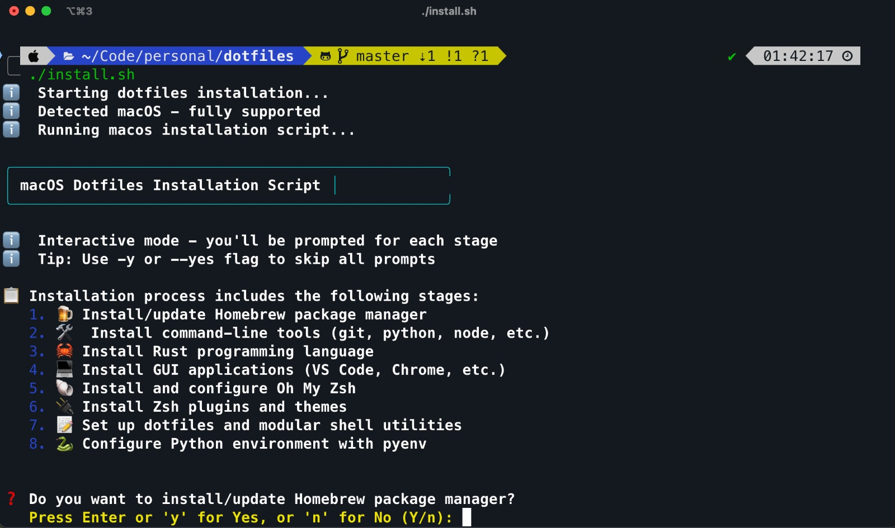

# Dotfiles

A comprehensive dotfiles setup for macOS and Linux (Ubuntu/Debian-based; includes WSL). Built with extensibility in mind.




## Features

### 🛠️ Command Line Tools

- **Git** - Version control with optimized configuration
- **Python 3** (via pyenv) - Python version management
- **Rust** - Systems programming language with Cargo
- **Node.js & npm** - JavaScript runtime and package manager
- **Yarn** - Fast package manager
- **TypeScript** - Typed JavaScript
- **OpenJDK (Java)** - Java runtime and tools
- **Vim** - Text editor with comprehensive configuration
- **Tmux** - Terminal multiplexer with modern setup
- **Zsh + Oh My Zsh + Powerlevel10k** - Advanced shell with beautiful theme
- **bat** - Enhanced cat with syntax highlighting
- **eza** - Modern ls replacement
- **ruff** - Fast Python linter
- **uv** - Ultra-fast Python package installer
- **pre-commit** - Git hooks framework
- **pyenv** - Python version management
- **btop** - Modern system monitor (alternative to htop)
- **nmap** - Network discovery and security auditing utility
- **htop** - Interactive process viewer
- **ipython** - Enhanced interactive Python shell
- **ripgrep** - Fast text search tool (rg command)
- **fzf** - Command-line fuzzy finder
- **delta** - Syntax-highlighting pager for git diffs
- **watch** - Periodically run a command and display output
- **helm** - Kubernetes package manager
- **speedtest-cli** - Command-line internet speed test tool

### 📱 Applications (macOS)

- **iTerm2** - Advanced terminal emulator
- **Warp** - Modern terminal with AI features
- **Raycast** - Productivity launcher
- **Cursor** - AI-powered code editor
- **Visual Studio Code** - Popular code editor

- **Google Chrome** - Web browser
- **Brave Browser** - Privacy-focused browser
- **Slack** - Team communication
- **Sublime Text** - Lightweight text editor
- **Obsidian** - Knowledge management and note-taking
- **Docker Desktop** - Container development platform
- **Wireshark** - Network protocol analyzer
- **Postman** - API development and testing tool
- **Typora** - Markdown editor
- **DBeaver Community** - Universal database management tool

### ⚙️ Configuration Files

- `.vimrc` - Comprehensive Vim configuration with modern features, keybindings, and language-specific settings
- `.tmux.conf` - Tmux setup with Ctrl-a prefix, mouse support, and improved splitting
- `.zshrc` - Zsh configuration with Oh My Zsh, Powerlevel10k theme, and modular utilities loading
- `.gitconfig` - Git configuration with user settings and credential helpers

### 🧰 Modular Shell Utilities

The dotfiles include a modular utilities system located at `~/.config/shell-utils/`:

- **`functions.sh`** - Essential functions like `extract()`, `mkcd()`, and beautiful logging functions
- **Extensible** - Add your own `.sh` files to the directory and they'll be automatically loaded

**Key utilities include:**

- `extract <file>` - Universal archive extractor (zip, tar, rar, etc.)
- `mkcd <dir>` - Create directory and navigate to it
- Beautiful logging functions with colors and icons for scripts
- And more...

## Installation

### Prerequisites

- macOS or Linux (Ubuntu/Debian-based; includes WSL)
- Internet connection
- Administrative privileges (sudo)

### Quick Install

```bash
# Clone the repository
git clone <your-repository-url> ~/.dotfiles
cd ~/.dotfiles

# Run the installation script
./install.sh

# Or run in non-interactive mode (auto-confirm all prompts)
./install.sh -y
```

### Command Line Options

- `./install.sh` - Interactive mode (prompts for each installation stage)
- `./install.sh -y` or `./install.sh --yes` - Non-interactive mode (auto-confirms all prompts)
- `./install.sh -h` or `./install.sh --help` - Show help message

### What the installer does

Common steps (macOS and Linux):

- **OS Detection** - Automatically detects your operating system
- **CLI Tools** - Installs development tools
- **Rust** - Installs Rust (rustup) and Cargo
- **Oh My Zsh** - Installs and configures Oh My Zsh
- **Zsh plugins** - Installs autosuggestions, syntax-highlighting, and Powerlevel10k theme
- **Dotfiles Setup** - Symlinks configuration files and installs modular shell utilities
- **Python Setup** - Installs latest Python 3 via pyenv and sets it globally

macOS only:

- **Homebrew** - Installs/updates Homebrew
- **Applications** - Installs GUI apps via Homebrew Cask (VS Code, Cursor, browsers, etc.)

Linux only:

- **apt basics** - Updates apt and installs base packages for Ubuntu/Debian

## Usage

### After Installation

1. Restart your terminal or run `source ~/.zshrc`

2. **Handle macOS Security Warnings (macOS only; Important!)**

   When you first open newly installed applications, macOS may show security warnings because they weren't downloaded from the App Store. This is normal and expected.

   **To resolve security warnings:**

   - **Method 1:** Right-click the app in Applications folder → select "Open" → click "Open" in the dialog
   - **Method 2:** Go to System Settings → Privacy & Security → click "Allow Anyway" next to the blocked app

   This only needs to be done once per application.

3. Set your personal Git identity in a private file:

   ```bash
   # Create ~/.gitconfig.local with your personal details (not tracked in this repo)
   cat > ~/.gitconfig.local <<'EOF'
   [user]
     name = Your Name
     email = your.email@example.com
     username = your-username
   EOF
   ```

### Key Features

#### Vim Configuration

- Modern vim setup with sensible defaults and true color support
- Comprehensive syntax highlighting and file type detection
- Space as leader key with intuitive key mappings
- Persistent undo, backup, and swap file management
- Language-specific indentation (Python, JavaScript, TypeScript, Rust, YAML, HTML/CSS)
- Window and buffer navigation shortcuts
- Automatic whitespace cleanup and spell checking
- Enhanced status line with file information

#### Tmux Configuration

- `Ctrl-a` as prefix key (instead of default `Ctrl-b`)
- Mouse support enabled for easier pane interaction
- Intuitive pane splitting with `\` (vertical) and `-` (horizontal)
- Easy config reloading with `Ctrl-a r`
- Simplified, clean configuration focused on essential features

#### Zsh Configuration

- Oh My Zsh with Powerlevel10k theme for beautiful, informative prompt
- Enhanced ls commands using `eza`
- Enhanced cat using `bat`
- Comprehensive git aliases and development shortcuts
- Modular utilities system that automatically loads all `.sh` files from `~/.config/shell-utils/`
- Useful functions for productivity and development workflows
- Command history optimization and plugin support

For customization instructions and contribution guidelines, see [CONTRIBUTING.md](CONTRIBUTING.md).

## Testing Your Installation

After running the installer, verify with the comprehensive test script:

```bash
./test_install.sh
```

**What the test script checks:**

- ✅ **Essential CLI Tools** - Verifies git, python3, vim, tmux, node, npm, yarn, zsh
- ✅ **Development Tools** - Checks rust, cargo, pyenv, uv, TypeScript, bat, eza, ruff, pre-commit, btop, nmap, htop, ipython, ripgrep, helm
- ✅ **Oh My Zsh** - Validates Oh My Zsh installation and configuration
- ✅ **Dotfiles Symlinking** - Ensures all dotfiles are properly symlinked
- ✅ **Python Environment** - Verifies pyenv and Python version setup
- ✅ **Configuration Files** - Validates content of .zshrc, .gitconfig, and other configs
- ✅ **Environment Setup** - Checks PATH configuration for Homebrew and Cargo
- ✅ **Tool Versions** - Displays version information for installed tools
- ✅ **File Permissions** - Ensures scripts are executable

The test script provides detailed output showing which components passed or failed, making it easy to identify any issues with your installation.

## License

This project is open source and available under the [MIT License](LICENSE).
