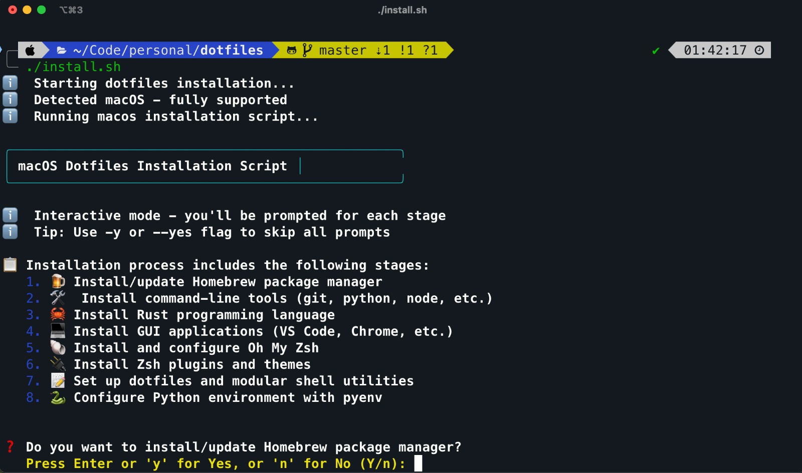

# Dotfiles

A comprehensive dotfiles setup for macOS and Linux (Ubuntu/Debian-based; includes WSL).



## Features

### 🛠️ Command Line Tools

#### Programming Languages

|                                   |                                    |                                |                                               |
| --------------------------------- | ---------------------------------- | ------------------------------ | --------------------------------------------- |
| [Python](https://www.python.org/) | [Rust](https://www.rust-lang.org/) | [Node.js](https://nodejs.org/) | [TypeScript](https://www.typescriptlang.org/) |
| [OpenJDK](https://openjdk.org/)   |                                    |                                |                                               |

#### Package & Version Management

|                                         |                              |                                       |                                      |
| --------------------------------------- | ---------------------------- | ------------------------------------- | ------------------------------------ |
| [pyenv](https://github.com/pyenv/pyenv) | [Yarn](https://yarnpkg.com/) | [uv](https://github.com/astral-sh/uv) | [poetry](https://python-poetry.org/) |
| [pre-commit](https://pre-commit.com/)   |                              |                                       |                                      |

#### Terminal & Shell

|                                              |                                               |                                        |                                                 |
| -------------------------------------------- | --------------------------------------------- | -------------------------------------- | ----------------------------------------------- |
| [Zsh](https://www.zsh.org/)                  | [Oh My Zsh](https://ohmyz.sh/)                | [Starship](https://starship.rs/)       | [Tmux](https://github.com/tmux/tmux)            |
| [bat](https://github.com/sharkdp/bat)        | [eza](https://github.com/eza-community/eza)   | [fzf](https://github.com/junegunn/fzf) | [zoxide](https://github.com/ajeetdsouza/zoxide) |
| [delta](https://github.com/dandavison/delta) | [glow](https://github.com/charmbracelet/glow) | [tldr](https://tldr.sh/)               | [watch](https://linux.die.net/man/1/watch)      |

#### Development Tools

|                                                  |                                    |                                           |                                                       |
| ------------------------------------------------ | ---------------------------------- | ----------------------------------------- | ----------------------------------------------------- |
| [Git](https://git-scm.com/)                      | [Vim](https://www.vim.org/)        | [ruff](https://github.com/astral-sh/ruff) | [ShellCheck](https://www.shellcheck.net/)             |
| [ripgrep](https://github.com/BurntSushi/ripgrep) | [jq](https://jqlang.github.io/jq/) | [fd](https://github.com/sharkdp/fd)       | [tree](https://gitlab.com/OldManProgrammer/unix-tree) |
| [ipython](https://ipython.org/)                  | [prettier](https://prettier.io/)   | [act](https://github.com/nektos/act)      | [GitHub CLI](https://cli.github.com/)                 |
| [Claude Code](https://claude.ai/code)            |                                    |                                           |                                                       |

#### System & DevOps

|                                              |                                                                |                                                    |                                                          |
| -------------------------------------------- | -------------------------------------------------------------- | -------------------------------------------------- | -------------------------------------------------------- |
| [btop](https://github.com/aristocratos/btop) | [htop](https://htop.dev/)                                      | [nmap](https://nmap.org/)                          | [speedtest-cli](https://github.com/sivel/speedtest-cli)  |
| [AWS CLI](https://aws.amazon.com/cli/)       | [helm](https://helm.sh/)                                       | [kubectx](https://github.com/ahmetb/kubectx)       | [kubectl](https://kubernetes.io/docs/reference/kubectl/) |
| [k9s](https://k9scli.io/)                    | [TShark](https://www.wireshark.org/docs/man-pages/tshark.html) | [neofetch](https://github.com/dylanaraps/neofetch) | [cloudflared](https://github.com/cloudflare/cloudflared) |

### 📱 Applications (macOS)

|                                                      |                                                  |                                                                   |                                          |
| ---------------------------------------------------- | ------------------------------------------------ | ----------------------------------------------------------------- | ---------------------------------------- |
| [iTerm2](https://iterm2.com/)                        | [Warp](https://www.warp.dev/)                    | [Raycast](https://www.raycast.com/)                               | [Cursor](https://cursor.sh/)             |
| [Visual Studio Code](https://code.visualstudio.com/) | [Google Chrome](https://www.google.com/chrome/)  | [Brave Browser](https://brave.com/)                               | [Slack](https://slack.com/)              |
| [Sublime Text](https://www.sublimetext.com/)         | [Obsidian](https://obsidian.md/)                 | [Docker Desktop](https://www.docker.com/products/docker-desktop/) | [Wireshark](https://www.wireshark.org/)  |
| [Postman](https://www.postman.com/)                  | [Paintbrush](https://paintbrush.sourceforge.io/) | [Typora](https://typora.io/)                                      | [DBeaver Community](https://dbeaver.io/) |
| [GitKraken](https://www.gitkraken.com/)              |                                                  |                                                                   |                                          |

### ⚙️ Configuration Files

- `.vimrc` - Comprehensive Vim configuration with modern features, keybindings, and language-specific settings
- `.tmux.conf` - Tmux setup with Ctrl-a prefix, mouse support, and improved splitting
- `.zshrc` - Zsh configuration with Oh My Zsh, Starship prompt, plugin support, and modular utilities loading
- `.gitconfig` - Git configuration with user settings and credential helpers

### 🧰 Modular Shell Utilities

The dotfiles include a modular utilities system located at `~/.config/shell-utils/`:

- **`functions.sh`** - Essential functions like `extract()`, `mkcd()`, and beautiful logging functions
- **`aliases.sh`** - Cross-shell aliases for everyday commands
- **Extensible** - Add your own `.sh` files to the directory and they'll be automatically loaded

## Installation

### Prerequisites

- macOS or Linux (Ubuntu/Debian-based; includes WSL)
- Internet connection
- Administrative privileges (sudo)

### Quick Install

```bash
# Clone the repository
git clone <your-repository-url> ~/.dotfiles
cd ~/.dotfiles

# Run the installation script
./install.sh

# Or run in non-interactive mode (auto-confirm all prompts)
./install.sh -y
```

### Command Line Options

- `./install.sh` - Interactive mode (prompts for each installation stage)
- `./install.sh -y` or `./install.sh --yes` - Non-interactive mode (auto-confirms all prompts)
- `./install.sh -h` or `./install.sh --help` - Show help message

### What the installer does

Common steps (macOS and Linux):

- **OS Detection** - Automatically detects your operating system
- **CLI Tools** - Installs development tools
- **Rust** - Installs Rust (rustup) and Cargo
- **Oh My Zsh** - Installs and configures Oh My Zsh
- **Zsh plugins** - Installs autosuggestions and syntax-highlighting plugins
- **Starship** - Installs and configures Starship as the active shell prompt
- **Dotfiles Setup** - Symlinks configuration files and installs modular shell utilities
- **Python Setup** - Installs latest Python 3 via pyenv and sets it globally

macOS only:

- **Homebrew** - Installs/updates Homebrew
- **Applications** - Installs GUI apps via Homebrew Cask (VS Code, Cursor, browsers, etc.)

Linux only:

- **apt basics** - Updates apt and installs base packages for Ubuntu/Debian

## Usage

### After Installation

1. Restart your terminal or run `source ~/.zshrc`

2. **Install a Nerd Font**

    A [Nerd Font](https://www.nerdfonts.com/) is required for terminal icons (used by Starship, eza, and other tools) to display correctly. Without one, you'll see placeholder characters or missing icons.

    **To install:**
    - Visit [nerdfonts.com/font-downloads](https://www.nerdfonts.com/font-downloads) and download a font (e.g., **MesloLGS NF** or **FiraCode Nerd Font**)
    - Install the font on your system
    - Set it as the default font in your terminal emulator (e.g., iTerm2, Windows Terminal, or your preferred terminal)

3. **Handle macOS Security Warnings (macOS only; Important!)**

    When you first open newly installed applications, macOS may show security warnings because they weren't downloaded from the App Store. This is normal and expected.

    **To resolve security warnings:**
    - **Method 1:** Right-click the app in Applications folder → select "Open" → click "Open" in the dialog
    - **Method 2:** Go to System Settings → Privacy & Security → click "Allow Anyway" next to the blocked app

    This only needs to be done once per application.

4. Set your personal Git identity in a private file:

    ```bash
    # Create ~/.gitconfig.local with your personal details (not tracked in this repo)
    cat > ~/.gitconfig.local <<'EOF'
    [user]
      name = Your Name
      email = your.email@example.com
      username = your-username
    EOF
    ```

### Key Features

#### Shell (Zsh) Configuration

- **Shell**: Zsh is the default interactive shell environment
- **Prompt/theme**: [Starship](https://starship.rs/) is used as the active prompt/theme
- **Plugin/theme manager**: [Oh My Zsh](https://ohmyz.sh/) manages shell plugins and can manage themes
- **Theme compatibility**: Oh My Zsh themes are still supported, and Powerlevel10k remains installable/usable, but theme loading is intentionally disabled in `.zshrc` (`ZSH_THEME=""`) because Starship is the active prompt
- **Aliases and functions**

#### Tmux Configuration

- `Ctrl-a` as prefix key (instead of default `Ctrl-b`)
- Mouse support enabled for easier pane interaction
- Intuitive pane splitting with `\` (vertical) and `-` (horizontal)
- Easy config reloading with `Ctrl-a r`
- Simplified, clean configuration focused on essential features

#### Vim Configuration

- Modern vim setup with sensible defaults and true color support
- Comprehensive syntax highlighting and file type detection
- Space as leader key with intuitive key mappings
- Persistent undo, backup, and swap file management
- Language-specific indentation (Python, JavaScript, TypeScript, Rust, YAML, HTML/CSS)
- Window and buffer navigation shortcuts
- Automatic whitespace cleanup and spell checking
- Enhanced status line with file information

For customization instructions and contribution guidelines, see [CONTRIBUTING.md](CONTRIBUTING.md).

## Testing Your Installation

After running the installer, verify with the comprehensive test script:

```bash
./test_install.sh
```

The test script provides detailed output showing which components passed or failed, making it easy to identify any issues with your installation.

## License

This project is open source and available under the [MIT License](LICENSE).
